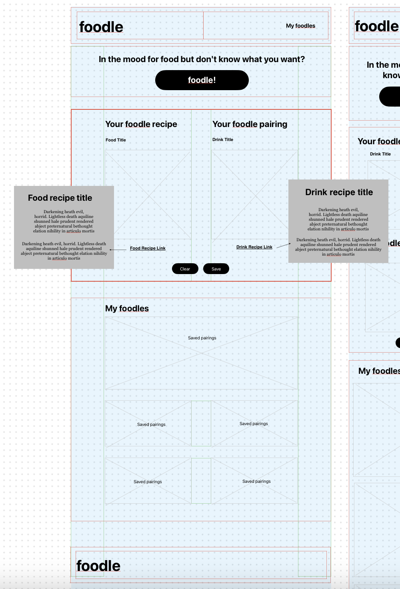

# foodle

https://gpaul12.github.io/foodle/

Don't know what to eat?
 
<b>Use foodle to find out what's for dinner.</b>

<i>Created by Erynn Affeldt, Gerry Paul, Jamie Nadel, Justin Nuzum, & Virginia Butler</i>

#

## Table of Contents 
- [Description](#description)
- [Installation](#installation)
- [Usage](#usage)
- [Contributors](#contributors)

## Description

This application chooses a random meal and drink pairing at the click of a button (foodle!). The app offers details of recipes with titles and images. The user can choose to save the pairings locally for later or clear and start again. Upon return to the application, pairings will be saved and the user can revisit their "foodles".

Additional key elements:
- Styling with Bulma
- Javascript
- 2 API use

## Installation

Open the application in a browser by clicking on this link:
https://gpaul12.github.io/foodle/

## Usage

## Wireframe

## Screenshots

#

## Contributors
Erynn Affeldt, Gerry Paul, Jamie Nadel, Justin Nuzum, & Virginia Butler
Bulma